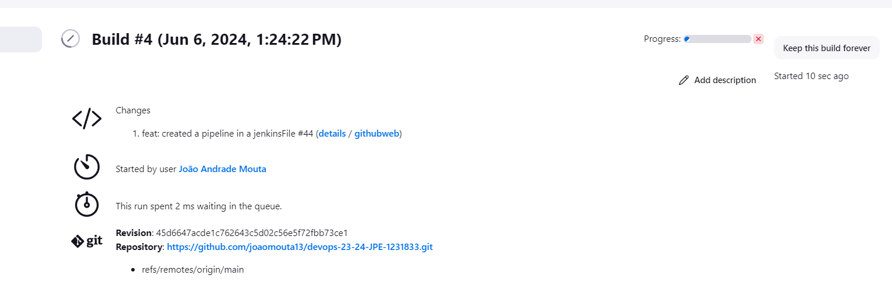
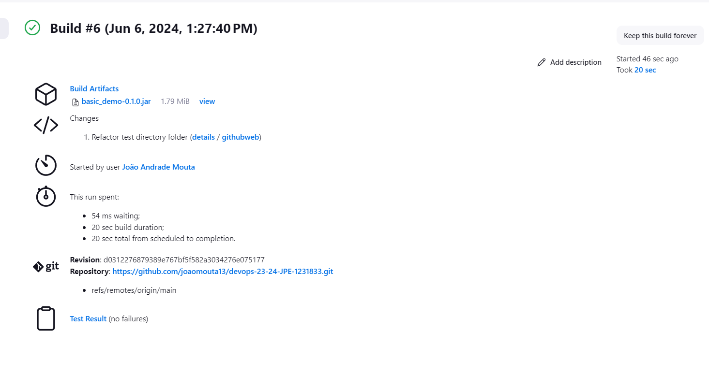

# DevOps Technical Report | Class Assignment 5 - Part 1

## Part 1 - CI/CD with Jenkins

### Introduction
The goal of this assignment is to use Jenkins to set up a CI/CD pipeline for the Spring Boot application developed in the previous assignments.

### Requirements

1. The goal is to create a very simple pipeline.
2. Define the following stages in the pipeline:
* Checkout:
  * To check out the code from the repository.
* Assemble:
  * Compiles and Produces the archive files with the application.
    * Do not use the build task of gradle (it will execute the tests).
* Test:
  * Execute the Unit Tests and publish in Jenkins the Test results.
* Archive:
  * Archive in Jenkins the archive files (generate during the Assemble stage).

3. Deploy the application in a container.
4. Create a technical report with the steps to implement the pipeline.

### Implementation

1. Install Jenkins in a docker container.
```bash
docker run -d -p 6969:8080 -p 50000:50000 -v jenkins-data:/var/jenkins_home --name=jenkins jenkins/jenkins:lts-jdk21
```

2. Access Jenkins in the browser.
* Enter localhost:6969 in the browser.
* Unlock Jenkins with the initial password.
 * Enter the container;
 * Enter Logs;
 * Copy the Admin password;

3. Install the suggested plugins.

4. Create a new pipeline.

* I've used a scripted syntax to create the pipeline.
```groovy
pipeline {
    agent any

    stages {
        stage('Checkout') {
            steps {
                echo 'Checking out the code from the repository'
                git branch: 'main', url: 'https://github.com/diogo-m-oliveira/devops-23-24-JPE-1140500.git'
            }
        }
        stage('Assemble') {
            steps {
                echo 'Assembling...'
                dir('ca2/part1') {
                    sh 'chmod +x ./gradlew'
                    sh './gradlew clean assemble'
                }
            }
        }
        stage('Test') {
            steps {
                echo 'Testing...'
                dir('ca2/part1') {
                    sh './gradlew test'
                    junit 'build/test-results/test/*.xml'
                }
            }
        }
        stage('Archive') {
            steps {
                echo 'Archiving...'
                dir('ca2/part1') {
                    archiveArtifacts 'build/libs/*.jar'
                }
            }
        }
    }
}
```

5. In the browser, create a new job "Example"
6. Scroll to the "Pipeline" section and then enter the JenkinsFile.
7. Click save.
8. Now use "Build Now" to run the pipeline.




### Conclusion
### Conclusion

In this assignment, we successfully set up a simple CI/CD pipeline using Jenkins for a Spring Boot application. The pipeline consisted of four stages: Checkout, Assemble, Test, and Archive.

In the Checkout stage, we fetched the code from the repository. The Assemble stage involved compiling the code and producing the archive files with the application. During the Test stage, we executed the unit tests and published the test results in Jenkins. Finally, in the Archive stage, we archived the generated archive files in Jenkins.

We also deployed Jenkins in a Docker container and accessed it via a web browser. We created a new pipeline job in Jenkins and used a scripted syntax to define the pipeline stages.

This exercise demonstrated the power and flexibility of Jenkins in automating the build, test, and deployment processes, which is crucial in a DevOps environment. It allowed us to ensure the integrity of our code and automate the delivery process, making it more efficient and reliable.