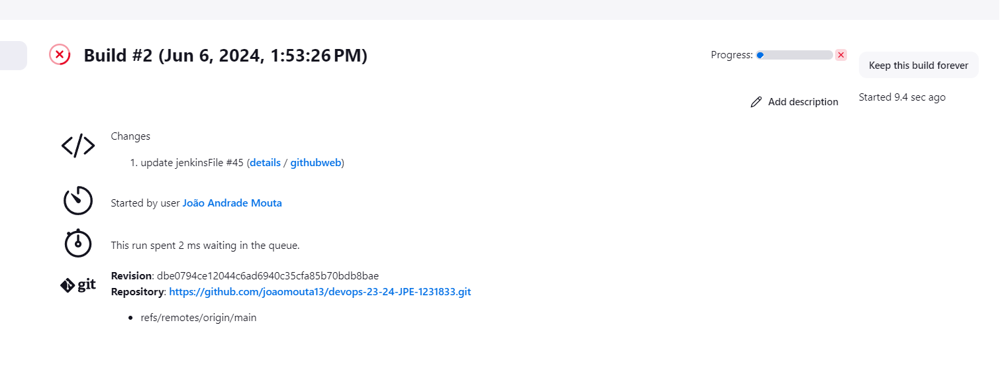
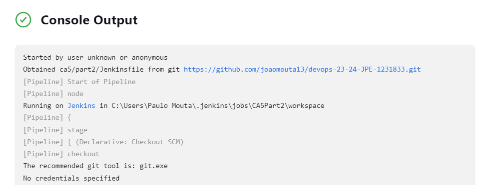
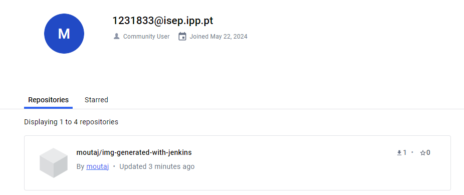

### Introduction
The goal of this assignment is to use Jenkins to set up a CI/CD pipeline for the Spring Boot application developed in the previous assignments.

### Requirements

1. The goal is to create a very simple pipeline.
2. Define the following stages in the pipeline:
* Checkout:
  * To check out the code from the repository.
* Assemble:
  * Compiles and Produces the archive files with the application.
    * Do not use the build task of gradle (it will execute the tests).
* Test:
  * Execute the Unit Tests and publish in Jenkins the Test results.
* Archive:
  * Archive in Jenkins the archive files (generate during the Assemble stage).

3. Deploy the application in a container.
4. Create a technical report with the steps to implement the pipeline.

### Implementation

1. Install Jenkins in a docker container.
```bash
docker run -d -p 6969:8080 -p 50000:50000 -v jenkins-data:/var/jenkins_home --name=jenkins jenkins/jenkins:lts-jdk21
```

2. Access Jenkins in the browser.
* Enter localhost:6969 in the browser.
* Unlock Jenkins with the initial password.
* Enter the container;
* Enter Logs;
* Copy the Admin password;

3. Install the suggested plugins.

4. Create a new pipeline.

* I've used a scripted syntax to create the pipeline.
```groovy
pipeline {
    agent any

    stages {
        stage('Checkout') {
            steps {
                echo 'Checking out the code from the repository'
                git branch: 'main', url: 'https://github.com/diogo-m-oliveira/devops-23-24-JPE-1140500.git'
            }
        }
        stage('Assemble') {
            steps {
                echo 'Assembling...'
                dir('ca2/part1') {
                    sh 'chmod +x ./gradlew'
                    sh './gradlew clean assemble'
                }
            }
        }
        stage('Test') {
            steps {
                echo 'Testing...'
                dir('ca2/part1') {
                    sh './gradlew test'
                    junit 'build/test-results/test/*.xml'
                }
            }
        }
        stage('Archive') {
            steps {
                echo 'Archiving...'
                dir('ca2/part1') {
                    archiveArtifacts 'build/libs/*.jar'
                }
            }
        }
    }
}
```

5. In the browser, create a new job "Example"
6. Scroll to the "Pipeline" section and then enter the JenkinsFile.
7. Click save.
8. Now use "Build Now" to run the pipeline.


# DevOps Technical Report | Class Assignment 5 - Part 2

## Part 2 - CI/CD with Jenkins

### Requirements

1. The goal is to create a very simple pipeline.
2. Define the following stages in the pipeline:
* Checkout:
    * To check out the code from the repository.
* Assemble:
    * Compiles and Produces the archive files with the application.
        * Do not use the build task of gradle (it will execute the tests).
* Test:
    * Execute the Unit Tests and publish in Jenkins the Test results.
* Javadoc:
    * Generate the Javadoc and publish in Jenkins the Javadoc.
* Archive:
    * Archive in Jenkins the archive files (generate during the Assemble stage).
* Publish Image:
  * Generate a docker image with Tomcat and the war file and publish it in the docker hub.
3. Deploy the application in a container.
4. Create a technical report with the steps to implement the pipeline.
5. Tag the repository with the tag ca5.

### Implementation

1. Download the Jenkins war file.
2. Run the following command in Windows terminal:
```bash
cd Desktop
java -jar jenkins.war --httpPort=9090
```

* Use the password: fb3cfb7ec753491c9d3b3758efaad07a
* Enter the browser using the port defined:
  * localhost:9090
* Enter the Admin Password
* Install the suggested plugins

3. Add docker credentials in Jenkins:
* Go to Jenkins > Manage Jenkins > Manage Credentials > Global Credentials > Add Credentials

4. Install the following plugins:
* Docker Pipeline
* Docker
* HTML publisher

5. Create a dockerFile in CA2/part2/part2:
```dockerfile
FROM tomcat:9-jdk17-openjdk

COPY ./build/libs/*.jar /usr/local/tomcat/webapps/

EXPOSE 8080
```

6. Create a new pipeline:

```groovy
pipeline {
  agent any

  environment {
    // Define Docker Hub credentials ID as configured in Jenkins credentials
    DOCKERHUB_CREDENTIALS = 'moutaj'
    // Define the Docker image name
    IMAGE_NAME = "moutaj/img-generated-with-jenkins"
    // Define JAVA_HOME for the pipeline
    JAVA_HOME = 'C:\\Program Files\\Java\\jdk-21'
    PATH = "${JAVA_HOME}\\bin;${env.PATH}"
  }

  stages {
    stage('Checkout') {
      steps {
        echo 'Checking out the code from the repository'
        git branch: 'main', url: 'https://github.com/joaomouta13/devops-23-24-JPE-1231833.git'
      }
    }

    stage('Assemble') {
      steps {
        echo 'Assembling...'
        dir('ca2/part2') {
          script {
            // Ensure the Gradle Wrapper is executable (Unix) or available (Windows)
            if (fileExists('./gradlew')) {
              if (isUnix()) {
                sh 'chmod +x ./gradlew'
                sh './gradlew clean assemble -x test'
              } else {
                bat 'gradlew.bat clean assemble -x test'
              }
            } else {
              error 'Gradle Wrapper not found!'
            }
          }
        }
      }
      post {
        success {
          // Archive the build artifacts
          archiveArtifacts artifacts: '**/build/libs/*.jar', allowEmptyArchive: true
        }
      }
    }

    stage('Test') {
      steps {
        echo 'Testing...'
        dir('ca2/part2') {
          script {
            if (fileExists('./gradlew')) {
              if (isUnix()) {
                sh './gradlew test'
              } else {
                bat 'gradlew.bat test'
              }
            } else {
              error 'Gradle Wrapper not found!'
            }
          }
        }
      }
      post {
        always {
          // Archive the JUnit test results
          junit '**/build/test-results/test/TEST-*.xml'
        }
      }
    }

    stage('Javadoc') {
      steps {
        echo 'Generating Javadoc...'
        dir('ca2/part2') {
          script {
            if (fileExists('./gradlew')) {
              if (isUnix()) {
                sh './gradlew javadoc'
              } else {
                bat 'gradlew.bat javadoc'
              }
            } else {
              error 'Gradle Wrapper not found!'
            }
          }
        }
      }
      post {
        success {
          // Archive and publish Javadoc
          archiveArtifacts artifacts: '**/build/docs/javadoc/**', allowEmptyArchive: true
          publishHTML target: [
                  allowMissing: false,
                  alwaysLinkToLastBuild: true,
                  keepAll: true,
                  reportDir: 'ca2/part2/build/docs/javadoc',
                  reportFiles: 'index.html',
                  reportName: 'Javadoc Report'
          ]
        }
      }
    }

    stage('Archive') {
      steps {
        echo 'Archiving...'
        dir('ca2/part2') {
          // Archive build artifacts
          archiveArtifacts artifacts: '**/build/libs/*.jar', allowEmptyArchive: true
        }
      }
    }

    stage('Publish Image') {
      steps {
        echo 'Publishing Docker image...'
        script {
          def dockerImage = docker.build("${IMAGE_NAME}:${env.BUILD_NUMBER}", '--progress=plain ca2/part2')
          docker.withRegistry('https://registry.hub.docker.com', DOCKERHUB_CREDENTIALS) {
            dockerImage.push()
            dockerImage.push('latest')
          }
        }
      }
    }
  }

  post {
    always {
      cleanWs()
    }
  }
}
```
7. Run the pipeline.
```bash
   java -jar jenkins.war --httpPort=9090
```

* Pipeline Build Image:

* Pipeline Build success:

* DockerHub Image:


### Conclusion

In this assignment, we have successfully set up two CI/CD pipelines using Jenkins for a Spring Boot application. The first pipeline consisted of four stages: Checkout, Assemble, Test, and Archive. 

The second pipeline added two more stages: Javadoc and Publish Image.  

In the Checkout stage, we fetched the code from the repository. The Assemble stage involved compiling the code and producing the archive files with the application. During the Test stage, we executed the unit tests and published the test results in Jenkins. In the Javadoc stage, we generated the Javadoc and published it in Jenkins. The Archive stage involved archiving the generated archive files in Jenkins. Finally, in the Publish Image stage, we generated a Docker image with Tomcat and the war file and published it in Docker Hub.  

We also deployed Jenkins in a Docker container and accessed it via a web browser. We created new pipeline jobs in Jenkins and used a scripted syntax to define the pipeline stages.  This exercise demonstrated the power and flexibility of Jenkins in automating the build, test, and deployment processes, which is crucial in a DevOps environment. It allowed us to ensure the integrity of our code, automate the delivery process, and make it more efficient and reliable. 

Furthermore, it showed how we can extend our pipeline with additional stages to meet specific requirements, such as generating Javadoc and publishing a Docker image.